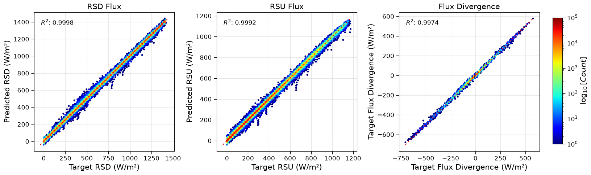
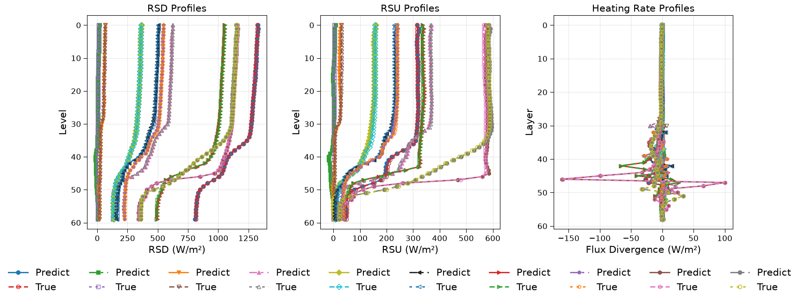

Atmosphere entire radiation scheme benchmark
============================================

This section documents the experimental results comparing different neural network architectures for radiative transfer modeling in the RTnn framework, using the CAMS (Copernicus Atmosphere Monitoring Service) dataset. All models were trained with identical hyperparameters where applicable.

.. note::
   The heating rate (HR) metrics in this benchmark are on the same unit as the flux metrics. While the high R² values indicate excellent predictive performance for both outputs, the HR metrics are reported in units of W/m² (flux divergence) and thus appear numerically larger.

Model Performance Comparison
----------------------------

This presents a comprehensive comparison of four different neural network architectures trained on the CAMS dataset. All models were trained with identical hyperparameters where applicable.

Experiment Configuration
~~~~~~~~~~~~~~~~~~~~~~~~

All models were trained with the following common configuration:

- **Dataset**: CAMS (Copernicus Atmosphere Monitoring Service) data
- **Training years**: 2009-2018
- **Testing year**: 2014
- **Input features**: 11 channels (tlay, play, h2o, o3, co2, n2o, ch4, cloud_lwp, cloud_iwp, mu0, sfc_alb)
- **Output channels**: 2 (rsd, rsu)
- **Sequence length**: 60 vertical levels
- **Normalization**: minmax/log1p-standard scaling
- **Loss function**: Huber loss (β=0.5, δ=1.0)
- **Learning rate**: 0.0001
- **Batch size**: 4
- **Epochs**: 400
- **Hidden size**: 256
- **Number of layers**: 3
- **Dropout**: 0.1

Model Architectures
~~~~~~~~~~~~~~~~~~~

Four different architectures were evaluated:

1. **LSTM** (Long Short-Term Memory)

   - Traditional recurrent architecture
   - Model identifier: `lstm_h256_l3_d0d1`

2. **GRU** (Gated Recurrent Unit)

   - Simplified recurrent architecture
   - Model identifier: `gru_h256_l3_d0d1`

3. **Transformer Encoder**

   - Attention-based architecture with 4 heads
   - Embedding size: 256
   - Forward expansion factor: 4
   - Model identifier: `encodertorch_e256_h4_l3_fe4_d0d1`

4. **FCN** (Fully Connected Network)

   - Baseline dense architecture
   - Model identifier: `fcn_h256_l3_d0d1`

Performance Metrics
~~~~~~~~~~~~~~~~~~~

The following metrics were used for evaluation (validation set, epoch 400):

- **Loss**: Huber loss value
- **NMAE**: Normalized Mean Absolute Error (normalized by target range)
- **NMSE**: Normalized Mean Squared Error (normalized by target variance)
- **MAE**: Mean Absolute Error (in physical units)
- **MSE**: Mean Squared Error (in physical units)
- **R²**: Coefficient of determination
- **Runtime**: Training time per epoch (in seconds)

Quantitative Comparison - Fluxes
~~~~~~~~~~~~~~~~~~~~~~~~~~~~~~~~

The table below shows the performance comparison for the 2 flux outputs (``rsd`` and ``rsu``) at epoch 400 (final epoch).

.. list-table:: Performance comparison for flux predictions (validation set, epoch 400)
   :header-rows: 1
   :widths: 15, 12, 12, 12, 12, 15, 15, 12
   :align: center

   * - Model
     - Loss ↓
     - NMAE ↓
     - NMSE ↓
     - R² ↑
     - MAE ↓
     - MSE ↓
     - Runtime (s/epoch)
   * - LSTM
     - 8.55e-05
     - 8.15e-03
     - 9.28e-03
     - 0.999769
     - 3.14e-03
     - 4.52e-03
     - 34.0 - 37.0
   * - GRU
     - 1.07e-04
     - 1.19e-02
     - 1.35e-02
     - 0.999516
     - 4.60e-03
     - 6.54e-03
     - 33.8 - 36.0
   * - Transformer
     - 1.95e-03
     - 8.55e-02
     - 8.64e-02
     - 0.998632
     - 3.29e-02
     - 4.20e-02
     - ~35.0
   * - FCN
     - 2.88e-03
     - 6.82e-02
     - 7.72e-02
     - 0.984064
     - 2.62e-02
     - 3.75e-02
     - ~30.0

*Note: ↓ indicates lower is better, ↑ indicates higher is better. MAE and MSE are reported in physical units (W/m²).*

Quantitative Comparison - Heating Rates
~~~~~~~~~~~~~~~~~~~~~~~~~~~~~~~~~~~~~~~

The table below shows the performance for the heating rate output at epoch 400 (final epoch).

.. list-table:: Performance comparison for heating rate predictions (validation set, epoch 400)
   :header-rows: 1
   :widths: 15, 12, 12, 12, 15, 15
   :align: center

   * - Model
     - NMAE ↓
     - NMSE ↓
     - R² ↑
     - MAE ↓
     - MSE ↓
   * - LSTM
     - 6.47e-02
     - 4.99e-02
     - 0.997423
     - 3.37e-01
     - 8.51e-01
   * - GRU
     - 7.02e-02
     - 5.51e-02
     - 0.996855
     - 3.66e-01
     - 9.40e-01
   * - Transformer
     - 9.35e-02
     - 6.65e-02
     - 0.995337
     - 4.87e-01
     - 9.38e+00
   * - FCN
     - 9.34e-01
     - 6.74e-01
     - 0.529233
     - 4.87e+00
     - 1.15e+01

*Note: Heating rate metrics are on a different scale than flux metrics.*

Quantitative Comparison - Training vs Validation
~~~~~~~~~~~~~~~~~~~~~~~~~~~~~~~~~~~~~~~~~~~~~~~~

.. list-table:: Training vs Validation metrics (fluxes, epoch 400)
   :header-rows: 1
   :widths: 20, 20, 20
   :align: center

   * - Model
     - Train Loss
     - Valid Loss
   * - LSTM
     - 8.60e-05
     - 8.55e-05
   * - GRU
     - 1.07e-04
     - 1.07e-04
   * - Transformer
     - 4.51e-03
     - 1.95e-03
   * - FCN
     - 3.18e-03
     - 2.88e-03

Key Findings
~~~~~~~~~~~~

**Best Overall Performance for Fluxes**: The **LSTM** model achieves the highest R² score (0.999769), lowest MAE (3.14e-03 W/m²), and lowest MSE (4.52e-03 W/m²) for the main flux outputs at epoch 400, demonstrating excellent capability in capturing radiative transfer processes in the CAMS data. The GRU performs similarly, with slightly higher errors but still exceptionally high accuracy.

**Best Performance for Heating Rates**: The **LSTM** model also shows better performance for heating rate predictions, achieving the highest R² values (0.997423), lowest MSE (8.51e-01 K/day), and lowest MAE (3.37e-01 K/day).

**Runtime Efficiency**: The **FCN** model is the fastest (~30 s/epoch) but at the cost of significantly lower accuracy. The recurrent models (LSTM, GRU) are also efficient with ~34-36 s/epoch. The Transformer model has a similar runtime to the recurrent models.

**Generalization Gap**: LSTM and GRU show excellent generalization with minimal gap between training and validation. The Transformer shows a larger gap but still performs well. The FCN shows the largest gap between training and validation performance.

**Model Complexity**: LSTM and GRU are parameter-efficient (2.8M for GRU, 3.7M for LSTM), making them powerful yet lightweight choices for the CAMS task.

Recommendations
~~~~~~~~~~~~~~~

Based on the comparison results at epoch 400:

1. **For maximum accuracy**: Use **LSTM** or **GRU** models.
2. **For balanced performance and efficiency**: Use **GRU**.
3. **For real-time applications**: Use **FCN** as a lightweight baseline, but be aware of the significant drop in accuracy.

Diagnostic Visualizations
-------------------------

This section presents diagnostic plots generated at epoch 400 for the LSTM model, showing prediction quality across all validation samples.

Aggregated Results (All Samples)
~~~~~~~~~~~~~~~~~~~~~~~~~~~~~~~~

The following figure shows the density scatter plots (hexbin) for all validation samples, comparing predicted vs observed values for the two flux outputs and the heating rate. The diagonal red dashed line represents perfect prediction (y=x), and the R² score is displayed in each panel.

   **Figure 1:** Aggregated validation results for LSTM model at epoch 400.
   Left: rsd (downwelling short wave flux).
   Middel: rsu (upwelling short wave flux).
   Right: Heating rate.
   The color scale represents the logarithm of point density.

The aggregated results demonstrate excellent agreement between predictions and observations, with R² values exceeding 0.9997 for both flux components and 0.9974 for the heating rate.

Profile Results (Sample Profiles)
~~~~~~~~~~~~~~~~~~~~~~~~~~~~~~~~~

The following figure shows the predicted vs target profiles for a random sample of 10 test points, across the 60 vertical levels.

   **Figure 2:** Profile validation results for LSTM model at epoch 400.
   Left: rsd (downwelling short wave flux).
   Middel: rsu (upwelling short wave flux).
   Right: Heating rate.
   Solid lines represent predictions, dashed lines represent targets.
   Each color represents a different sample.

The profile plots confirm that the model accurately captures the vertical structure of both fluxes and the heating rate, with predictions closely tracking the targets across all levels.
