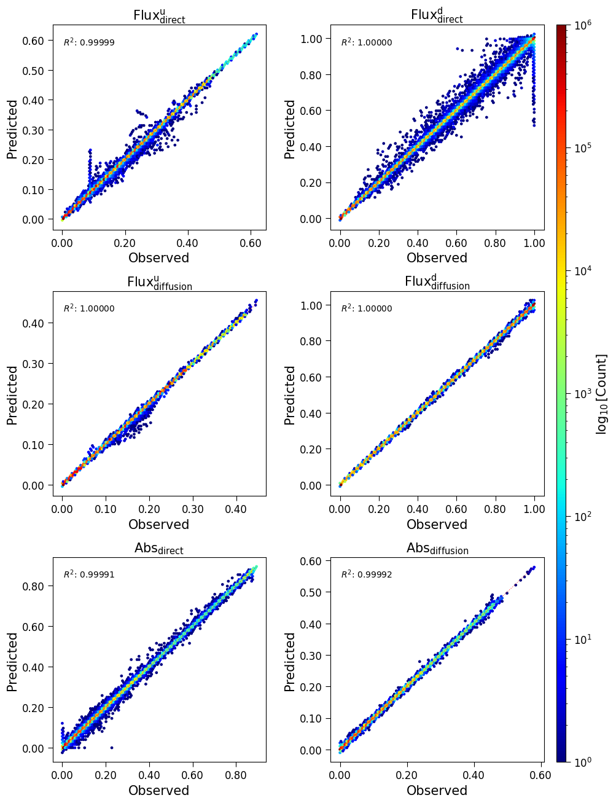
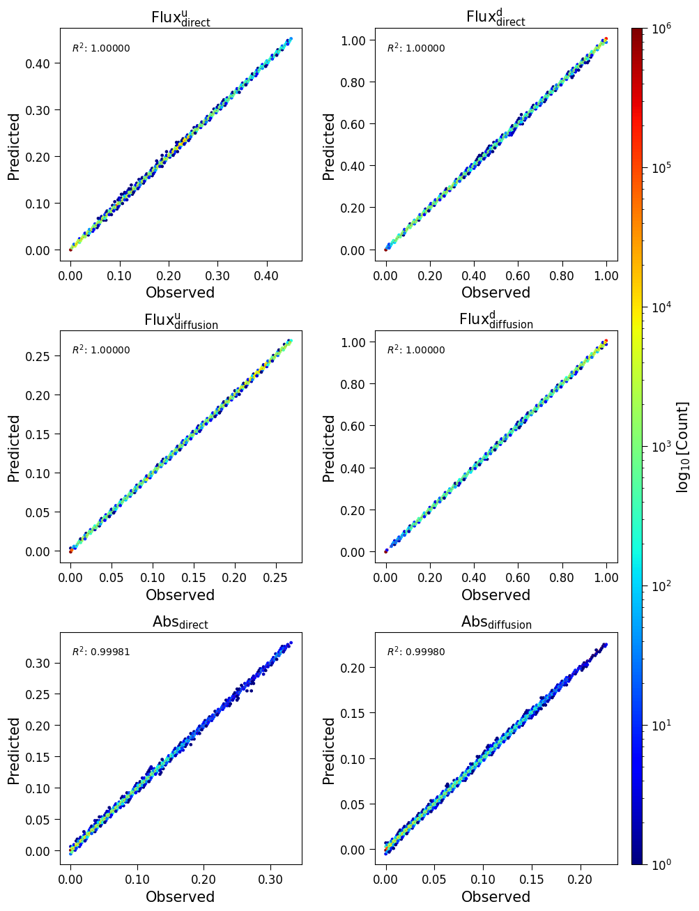
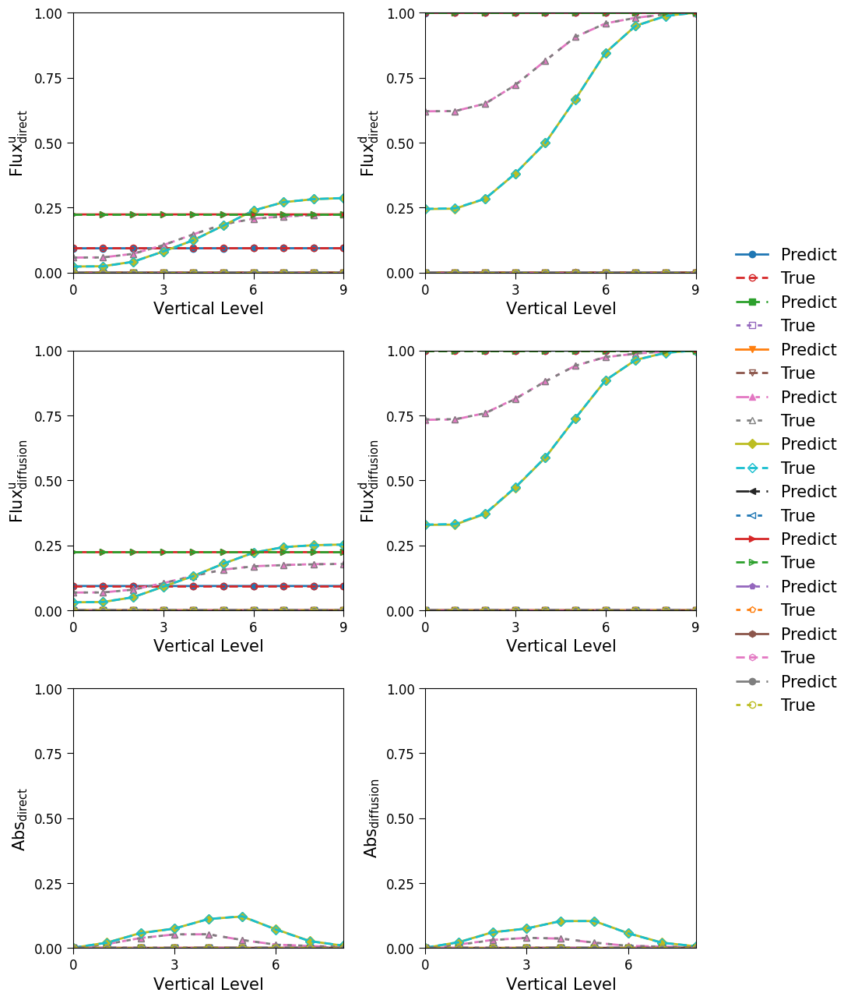
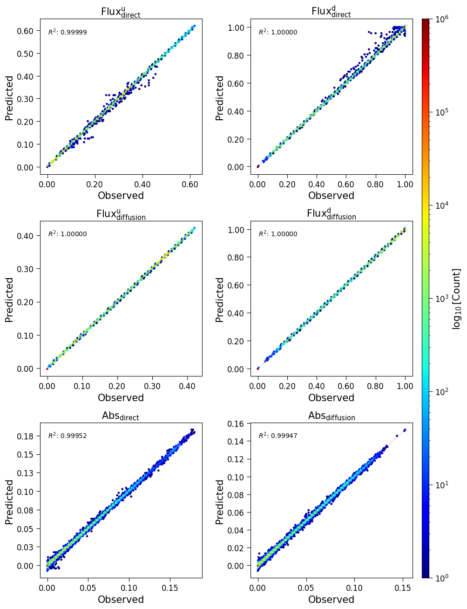
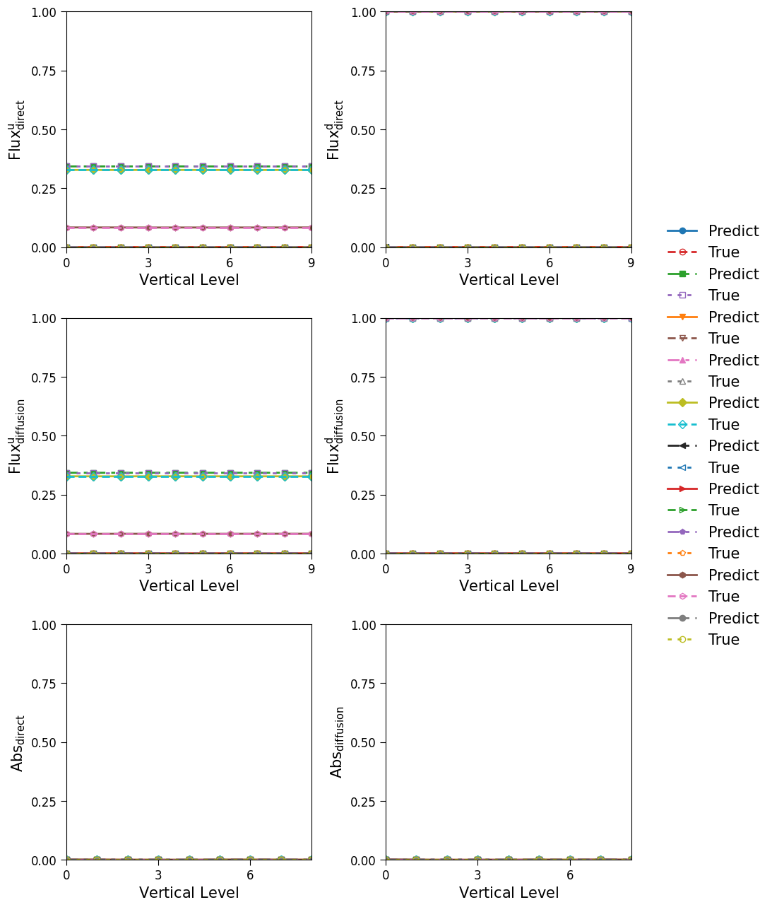

Benchmark
=========

This section documents the experimental results comparing different neural network architectures for radiative transfer modeling in the RTnn framework.

Model Performance Comparison
----------------------------

This presents a comprehensive comparison of five different neural network architectures trained on the LSM (Land Surface Model) dataset for radiative transfer modeling. All models were trained with identical hyperparameters where applicable to ensure fair comparison.

Experiment Configuration
~~~~~~~~~~~~~~~~~~~~~~~~

All models were trained with the following common configuration:

- **Dataset**: LSM (Land Surface Model) data from 1995-2000
- **Training years**: 1995-1999
- **Testing year**: 2000
- **Input features**: 121 channels
- **Output channels**: 120
- **Sequence length**: 10 vertical layers
- **Normalization**: log1p + standard scaling
- **Loss function**: Huber loss (β=0.5, δ=1.0)
- **Learning rate**: 0.0001
- **Batch size**: 4
- **Epochs**: 100
- **Hidden size**: 256
- **Number of layers**: 3
- **Dropout**: 0.1

Model Architectures
~~~~~~~~~~~~~~~~~~~

Five different architectures were evaluated:

1. **LSTM** (Long Short-Term Memory)

   - Traditional recurrent architecture
   - Model identifier: `lstm_h256_l3_d0d1`

2. **GRU** (Gated Recurrent Unit)

   - Simplified recurrent architecture
   - Model identifier: `gru_h256_l3_d0d1`

3. **Transformer Encoder**

   - Attention-based architecture with 4 heads
   - Embedding size: 256
   - Forward expansion factor: 4
   - Model identifier: `transformer_e256_h4_l3_fe4_d0d1`

4. **FCN** (Fully Connected Network)

   - Baseline dense architecture
   - Model identifier: `fcn_h256_l3_d0d1`

5. **PINN** (Physics-Informed Neural Network)

   - Hybrid architecture incorporating physical constraints
   - Model identifier: `pinn`

Performance Metrics
~~~~~~~~~~~~~~~~~~~

The following metrics were used for evaluation (validation set):

- **Loss**: Huber loss value
- **NMAE**: Normalized Mean Absolute Error (normalized by target range)
- **NMSE**: Normalized Mean Squared Error (normalized by target variance)
- **R²**: Coefficient of determination
- **Runtime**: Training time per epoch (in seconds)

Quantitative Comparison - Fluxes
~~~~~~~~~~~~~~~~~~~~~~~~~~~~~~~~

.. list-table:: Performance comparison for flux predictions (validation set)
   :header-rows: 1
   :widths: 20, 15, 15, 15, 15, 15
   :align: center

   * - Model
     - Loss ↓
     - NMAE ↓
     - NMSE ↓
     - R² ↑
     - Runtime (s/epoch)
   * - LSTM
     - 2.350e-06
     - 8.176e-04
     - 1.872e-03
     - 0.999996
     - 268.3
   * - GRU
     - 2.327e-06
     - 8.771e-04
     - 1.884e-03
     - 0.999996
     - 266.5
   * - Transformer
     - 4.603e-05
     - 4.200e-03
     - 8.227e-03
     - 0.999925
     - 486.8
   * - FCN
     - 6.724e-04
     - 2.036e-02
     - 3.213e-02
     - 0.998865
     - 228.9
   * - PINN
     - 1.394e-04
     - 8.829e-03
     - 1.426e-02
     - 0.999775
     - 1158.1

*Note: ↓ indicates lower is better, ↑ indicates higher is better*

Quantitative Comparison - Absorption (Channels 1-2)
~~~~~~~~~~~~~~~~~~~~~~~~~~~~~~~~~~~~~~~~~~~~~~~~~~~

.. list-table:: Performance comparison for absorption predictions (channels 1-2, validation set)
   :header-rows: 1
   :widths: 25, 20, 20, 20
   :align: center

   * - Model
     - NMAE ↓
     - NMSE ↓
     - R² ↑
   * - LSTM
     - 1.650e-02
     - 9.628e-03
     - 0.999903
   * - GRU
     - 1.474e-02
     - 9.406e-03
     - 0.999908
   * - Transformer
     - 6.382e-02
     - 4.634e-02
     - 0.997756
   * - FCN
     - 2.843e-01
     - 2.099e-01
     - 0.953906
   * - PINN
     - 1.002e-01
     - 5.670e-02
     - 0.996629

Quantitative Comparison - Absorption (Channels 3-4)
~~~~~~~~~~~~~~~~~~~~~~~~~~~~~~~~~~~~~~~~~~~~~~~~~~~

.. list-table:: Performance comparison for absorption predictions (channels 3-4, validation set)
   :header-rows: 1
   :widths: 25, 20, 20, 20
   :align: center

   * - Model
     - NMAE ↓
     - NMSE ↓
     - R² ↑
   * - LSTM
     - 1.692e-02
     - 9.453e-03
     - 0.999905
   * - GRU
     - 1.485e-02
     - 9.126e-03
     - 0.999911
   * - Transformer
     - 6.942e-02
     - 5.052e-02
     - 0.997266
   * - FCN
     - 1.949e-01
     - 1.605e-01
     - 0.972430
   * - PINN
     - 1.074e-01
     - 6.612e-02
     - 0.995321

Training Performance Comparison
~~~~~~~~~~~~~~~~~~~~~~~~~~~~~~~

.. list-table:: Training vs Validation metrics (fluxes)
   :header-rows: 1
   :widths: 30, 35, 35
   :align: center

   * - Model
     - Train Loss
     - Valid Loss
   * - LSTM
     - 7.149e-07
     - 2.350e-06
   * - GRU
     - 7.683e-07
     - 2.327e-06
   * - Transformer
     - 1.117e-04
     - 4.603e-05
   * - FCN
     - 5.403e-04
     - 6.724e-04
   * - PINN
     - 5.878e-05
     - 1.394e-04

Key Findings
~~~~~~~~~~~~

**Best Overall Performance for Fluxes**: The **LSTM** and **GRU** models achieve the highest R² scores (0.999996) and lowest errors for flux predictions across the 10 vertical layers, demonstrating excellent capability in capturing radiative transfer processes.

**Best Performance for Absorption**: The **GRU** model shows marginally better performance for absorption predictions, achieving the highest R² values (0.999911 for channels 3-4) and lowest NMAE values.

**Runtime Efficiency**: The **FCN** model is the fastest (228.9 s/epoch) but at the cost of significantly lower accuracy. The **PINN** model is the slowest (1158.1 s/epoch).

**Generalization Gap**: LSTM and GRU show excellent generalization with minimal gap between training and validation, while Transformer shows the largest gap.

Recommendations
~~~~~~~~~~~~~~~

Based on the comparison results across 10 vertical layers:

1. **For maximum accuracy**: Use **LSTM** or **GRU** models
2. **For balanced performance**: Use **GRU**
3. **For real-time applications**: Use **FCN** as a lightweight baseline
4. **For physics-constrained applications**: Use **PINN**

Diagnostic Visualizations
-------------------------

This section presents diagnostic plots generated at epoch 99 for the LSTM model, showing prediction quality across different Plant Functional Types (PFTs) and spectral bands.

Aggregated Results (All PFTs Combined)
~~~~~~~~~~~~~~~~~~~~~~~~~~~~~~~~~~~~~~

The following figure shows the density scatter plots (hexbin) for all PFTs combined, comparing predicted vs observed values for all four flux components and absorption channels. The diagonal red dashed line represents perfect prediction (y=x), and the R² score is displayed in each panel.

   **Figure 1:** Aggregated validation results for LSTM model at epoch 99.
   Top row: Direct flux upwelling (left) and downwelling (right).
   Middle row: Diffusion flux upwelling (left) and downwelling (right).
   Bottom row: Absorption for direct (left) and diffusion (right) channels.
   The color scale represents the logarithm of point density.

The aggregated results demonstrate excellent agreement between predictions and observations, with R² values exceeding 0.9999 for all flux components and above 0.9999 for absorption channels.

Per-PFT Results: Example PFT 11
~~~~~~~~~~~~~~~~~~~~~~~~~~~~~~~

Plant Functional Type 11 shows representative performance across the model. The following figures show both hexbin density plots and line plots for the VIS (Visible) and NIR (Near-Infrared) bands.

VIS Band Results for PFT 11
^^^^^^^^^^^^^^^^^^^^^^^^^^^

   **Figure 2:** Hexbin validation results for PFT 11, VIS band.
   Shows excellent prediction accuracy for this plant functional type
   in the visible spectral band.

   **Figure 3:** Line plot validation results for PFT 11, VIS band.
   The figure shows predictions (solid lines) vs targets (dashed lines)
   across 10 vertical layers for 10 randomly selected samples.
   Top panels: Direct flux upwelling (left) and downwelling (right).
   Middle panels: Diffusion flux upwelling (left) and downwelling (right).
   Bottom panels: Absorption for direct (left) and diffusion (right) channels.

NIR Band Results for PFT 11
^^^^^^^^^^^^^^^^^^^^^^^^^^^

   **Figure 4:** Hexbin validation results for PFT 11, NIR band.
   Demonstrates consistent performance across the near-infrared
   spectral band.

   **Figure 5:** Line plot validation results for PFT 11, NIR band.
   The figure shows predictions vs targets across vertical layers,
   demonstrating accurate capture of vertical profiles for both
   fluxes and absorption in the NIR band.
