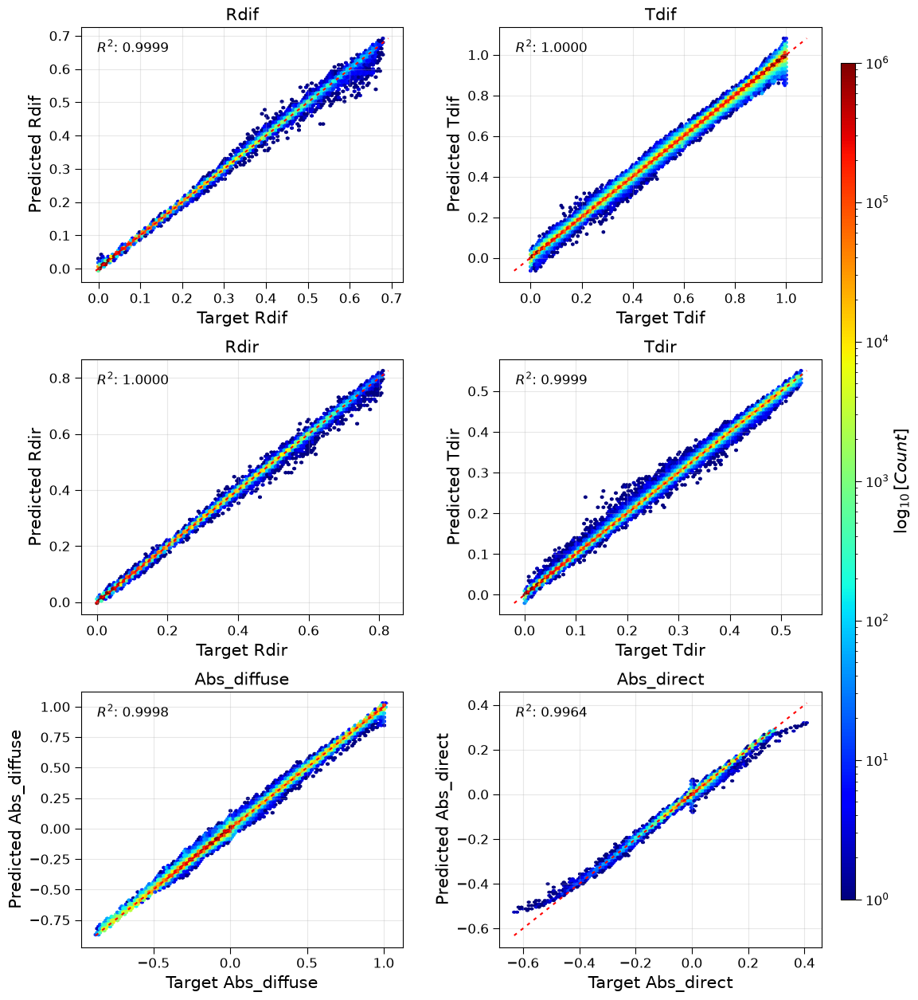

RTE reflectance-transmittance per g-point benchmark
===================================================

This section documents the experimental results comparing different neural network architectures for emulating reflectance and transmittance computations in the RTnn framework, using the CAMS REFTRANS dataset. The goal is to predict four outputs (diffuse reflectance, diffuse transmittance, direct reflectance, direct transmittance) from five input features.

.. note::
   This benchmark uses a different configuration than the flux benchmarks:

   - **Smaller hidden size**: 32 (vs 256 for flux benchmarks)
   - **Fewer layers**: 2 (vs 3 for flux benchmarks)
   - **Higher learning rate**: 0.001 (vs 0.0001 for flux benchmarks)
   - **More epochs**: 500 (vs 400 for flux benchmarks)
   - **Output channels**: 4 (rdif, tdif, rdir, tdir)
   - **Feature channels**: 5 (tau_sw, ssa_sw, g_sw, mu0, tnoscat)

Model Performance Comparison
----------------------------

This presents a comprehensive comparison of four different neural network architectures trained on the CAMS REFTRANS dataset. All models were trained with identical hyperparameters where applicable to ensure fair comparison.

Experiment Configuration
~~~~~~~~~~~~~~~~~~~~~~~~

All models were trained with the following common configuration:

- **Dataset**: CAMS REFTRANS (Reflectance-Transmittance) data
- **Training years**: 2009-2018
- **Testing year**: 2014
- **Input features**: 5 channels (tau_sw, ssa_sw, g_sw, mu0, tnoscat)
- **Output channels**: 4 (rdif, tdif, rdir, tdir)
- **Sequence length**: 60 vertical levels
- **Normalization**: minmax scaling (per-feature)
- **Loss function**: Huber loss (β=0.5, δ=1.0)
- **Learning rate**: 0.001
- **Batch size**: 4
- **Epochs**: 500
- **Hidden size**: 32
- **Number of layers**: 2
- **Dropout**: 0.1

Model Architectures
~~~~~~~~~~~~~~~~~~~

Four different architectures were evaluated:

1. **LSTM** (Long Short-Term Memory)
   - Traditional recurrent architecture
   - Model identifier: `lstm_h32_l2_d0d1`

2. **GRU** (Gated Recurrent Unit)
   - Simplified recurrent architecture
   - Model identifier: `gru_h32_l2_d0d1`

3. **Transformer Encoder**
   - Attention-based architecture with 4 heads
   - Embedding size: 32
   - Forward expansion factor: 2
   - Model identifier: `encodertorch_e32_h4_l2_fe2_d0d1`

4. **FCN** (Fully Connected Network)
   - Baseline dense architecture
   - Model identifier: `fcn_h32_l2_d0d1`

Performance Metrics
~~~~~~~~~~~~~~~~~~~

The following metrics were used for evaluation (validation set, epoch 499):

- **Loss**: Huber loss value
- **NMAE**: Normalized Mean Absolute Error (normalized by target range)
- **NMSE**: Normalized Mean Squared Error (normalized by target variance)
- **MAE**: Mean Absolute Error (in physical units)
- **MSE**: Mean Squared Error (in physical units)
- **R²**: Coefficient of determination
- **Runtime**: Training time per epoch (in seconds)

The outputs are divided into three groups for reporting:
- **Fluxes** (all 4 outputs combined)
- **abs12** (absorption channels 1-2: rdif, tdif)
- **abs34** (absorption channels 3-4: rdir, tdir)

Quantitative Comparison - Fluxes (All Outputs)
~~~~~~~~~~~~~~~~~~~~~~~~~~~~~~~~~~~~~~~~~~~~~~

The table below shows the performance comparison for all 4 flux outputs combined.

.. list-table:: Performance comparison for flux predictions (validation set, epoch 499)
   :header-rows: 1
   :widths: 15, 12, 12, 12, 12, 15, 15, 12
   :align: center

   * - Model
     - Loss ↓
     - NMAE ↓
     - NMSE ↓
     - R² ↑
     - MAE ↓
     - MSE ↓
     - Runtime (s/epoch)
   * - LSTM
     - 2.57e-05
     - 6.62e-03
     - 7.13e-03
     - 0.999949
     - 3.75e-03
     - 7.18e-03
     - ~126
   * - GRU
     - 3.72e-05
     - 7.96e-03
     - 8.63e-03
     - 0.999926
     - 4.52e-03
     - 8.68e-03
     - ~124
   * - Transformer
     - 9.74e-04
     - 3.86e-02
     - 4.54e-02
     - 0.997936
     - 2.15e-02
     - 4.42e-02
     - ~127
   * - FCN
     - 2.70e-02
     - 2.31e-01
     - 2.49e-01
     - 0.937880
     - 1.30e-01
     - 2.50e-01
     - ~122

*Note: ↓ indicates lower is better, ↑ indicates higher is better. MAE and MSE are reported in physical units.*

Quantitative Comparison - Absorption (Channels 1-2)
~~~~~~~~~~~~~~~~~~~~~~~~~~~~~~~~~~~~~~~~~~~~~~~~~~~

The table below shows the performance for absorption channels 1-2 (rdif, tdif).

.. list-table:: Performance comparison for absorption channels 1-2 (validation set, epoch 499)
   :header-rows: 1
   :widths: 15, 12, 12, 12, 15, 15
   :align: center

   * - Model
     - NMAE ↓
     - NMSE ↓
     - R² ↑
     - MAE ↓
     - MSE ↓
   * - LSTM
     - 2.35e-02
     - 1.54e-02
     - 0.999764
     - 1.67e-03
     - 3.06e-03
   * - GRU
     - 2.33e-02
     - 1.50e-02
     - 0.999774
     - 1.66e-03
     - 2.99e-03
   * - Transformer
     - 7.98e-02
     - 5.79e-02
     - 0.996648
     - 5.67e-03
     - 1.15e-02
   * - FCN
     - 8.69e-01
     - 4.87e-01
     - 0.762875
     - 6.18e-02
     - 9.68e-02

Quantitative Comparison - Absorption (Channels 3-4)
~~~~~~~~~~~~~~~~~~~~~~~~~~~~~~~~~~~~~~~~~~~~~~~~~~~

The table below shows the performance for absorption channels 3-4 (rdir, tdir).

.. list-table:: Performance comparison for absorption channels 3-4 (validation set, epoch 499)
   :header-rows: 1
   :widths: 15, 12, 12, 12, 15, 15
   :align: center

   * - Model
     - NMAE ↓
     - NMSE ↓
     - R² ↑
     - MAE ↓
     - MSE ↓
   * - LSTM
     - 1.81e-01
     - 6.00e-02
     - 0.996402
     - 2.03e-04
     - 4.95e-04
   * - GRU
     - 2.39e-01
     - 7.63e-02
     - 0.994181
     - 2.68e-04
     - 6.29e-04
   * - Transformer
     - 3.00e-01
     - 1.25e-01
     - 0.984250
     - 3.38e-04
     - 1.04e-03
   * - FCN
     - 1.45e+00
     - 7.67e-01
     - 0.411796
     - 1.64e-03
     - 6.34e-03

Quantitative Comparison - Training vs Validation
~~~~~~~~~~~~~~~~~~~~~~~~~~~~~~~~~~~~~~~~~~~~~~~~

.. list-table:: Training vs Validation metrics (fluxes, epoch 499)
   :header-rows: 1
   :widths: 20, 20, 20
   :align: center

   * - Model
     - Train Loss
     - Valid Loss
   * - LSTM
     - 2.59e-05
     - 2.57e-05
   * - GRU
     - 3.76e-05
     - 3.72e-05
   * - Transformer
     - 1.90e-03
     - 9.74e-04
   * - FCN
     - 3.01e-02
     - 2.70e-02

Key Findings
~~~~~~~~~~~~

**Best Overall Performance for Fluxes**: The **LSTM** model achieves the highest R² score (0.999949), lowest loss (2.57e-05), lowest MAE (3.75e-03), and lowest MSE (7.18e-03) for the combined flux outputs at epoch 499, demonstrating excellent capability in capturing reflectance and transmittance processes.

**Best Performance for Absorption Channels 1-2**: The **GRU** model shows marginally better performance for absorption channels 1-2, achieving the highest R² (0.999774) and lowest errors.

**Best Performance for Absorption Channels 3-4**: The **LSTM** model significantly outperforms others on absorption channels 3-4, achieving R² of 0.996402 compared to 0.994181 for GRU and 0.984250 for Transformer.

**Runtime Efficiency**: All models have similar runtime (~122-127 s/epoch) due to the small model sizes (19k-35k parameters). The FCN is slightly faster but with dramatically lower accuracy.

**Generalization Gap**: LSTM and GRU show excellent generalization with virtually no gap between training and validation. The Transformer shows a larger gap but still performs well. The FCN shows the largest gap and poorest overall performance.

**Model Complexity**: All models are very lightweight (19k-35k parameters), making them suitable for deployment in resource-constrained environments.

Recommendations
~~~~~~~~~~~~~~~

Based on the comparison results at epoch 499:

1. **For maximum accuracy**: Use **LSTM**.
2. **For balanced performance and efficiency**: Use **GRU**.
3. **For capturing direct reflectance/transmittance (channels 3-4)**: Use **LSTM**, which significantly outperforms other models on these more challenging outputs.
4. **For real-time applications**: Use **FCN** as a lightweight baseline, but be aware of the significant drop in accuracy (R² drops from 0.9999 to 0.9379).

Diagnostic Visualizations
-------------------------

This section presents diagnostic plots generated at epoch 499 for the LSTM model, showing prediction quality across all validation samples.

Aggregated Results (All Samples)
~~~~~~~~~~~~~~~~~~~~~~~~~~~~~~~~

The following figure shows the density scatter plots (hexbin) for all validation samples, comparing predicted vs observed values for the four flux outputs.

   **Figure 1:** Aggregated validation results for LSTM model at epoch 499.
   Top left: rdif (diffuse reflectance).
   Top right: tdif (diffuse transmittance).
   Middle left: rdir (direct reflectance).
   Middle right: tdir (direct transmittance).
   Bottom left: -dF_dif (negative flux divergence for diffuse component).
   Bottom right: -dF_dir (negative flux divergence for direct component).
   The color scale represents the logarithm of point density.

The aggregated results demonstrate excellent agreement between predictions and observations, with R² values exceeding 0.9999 for all flux components and strong performance for the gradient outputs.
