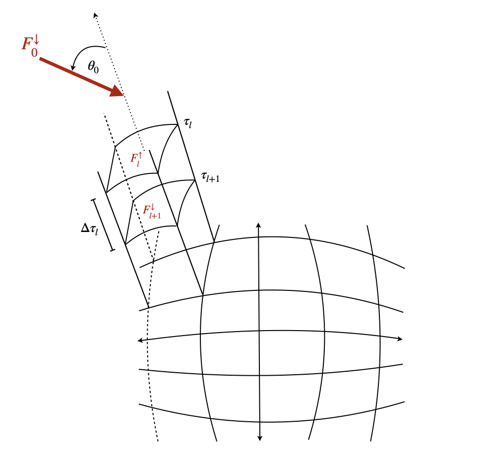
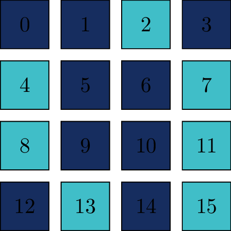

Training Strategy
=================

This section describes the training configuration, data preparation pipeline, and optimization strategies for RTnn.

Data Preparation
----------------

RTnn processes NetCDF files containing Land Surface Model (LSM) data with the naming convention:
`rtnetcdf_{processor_rank:03d}_{year}.nc`

   Structure of the vegetation canopy

**Vertical Canopy Structure:**

The model simulates radiative transfer through multiple vertical layers (default: 10 layers), representing different heights within the vegetation canopy. Each layer has its own optical properties (leaf area index, single scattering albedo, etc.) that influence radiation propagation.

**Processor Rank Distribution:**

Data is distributed across multiple processor ranks (typically 16 ranks). For training, a random subset (60%) is selected to reduce bias and improve generalization.

   Example of randomly selected MPI blocks used during training

**Random Spatial Mapping:**

- During training, a new random spatial mapping is generated for each time step
- 60% of processor ranks are randomly selected (data augmentation)
- The same mapping applies to all spatial batches within a time step
- Validation/testing uses 100% of processor ranks (deterministic)

**Input Features (121 channels):**

The input features are constructed from four variable groups, flattened across Plant Functional Types (PFTs, 15 types) and spectral bands (2 bands: VIS and NIR):

.. list-table:: Input Channel Composition
   :header-rows: 1
   :widths: 30 20 50

   * - Variable Group
     - Channels
     - Description
   * - coszang
     - 1
     - Cosine of solar zenith angle (direct beam direction)
   * - laieff_collim, laieff_isotrop
     - 30 (2 × 15 PFTs)
     - Leaf area index for collimated and isotropic radiation
   * - leaf_ssa, leaf_psd
     - 60 (2 × 2 bands × 15 PFTs)
     - Single scattering albedo and phase function asymmetry
   * - rs_surface_emu
     - 30 (1 × 2 bands × 15 PFTs)
     - Surface reflectance (soil albedo)
   * - **Total**
     - **121**
     -

**Output Targets (120 channels):**

The model predicts four output variables for each PFT and band combination:

.. list-table:: Output Channel Composition
   :header-rows: 1
   :widths: 30 20 50

   * - Variable Group
     - Channels
     - Description
   * - collim_alb
     - 30 (15 PFTs × 2 bands)
     - Collimated albedo (reflected direct radiation)
   * - collim_tran
     - 30 (15 PFTs × 2 bands)
     - Collimated transmittance (transmitted direct radiation)
   * - isotrop_alb
     - 30 (15 PFTs × 2 bands)
     - Isotropic albedo (reflected diffuse radiation)
   * - isotrop_tran
     - 30 (15 PFTs × 2 bands)
     - Isotropic transmittance (transmitted diffuse radiation)
   * - **Total**
     - **120**
     -

**Physical Constraint:**

For each layer, the outputs satisfy energy conservation:

.. math::

   \text{albedo} + \text{transmittance} + \text{absorption} = 1

This constraint is enforced as a soft penalty during training.

Hyperparameters
---------------

Learning Rate
~~~~~~~~~~~~~

.. code-block:: bash

   --learning_rate 0.001

**Recommendations:**

- LSTM/GRU: 1e-3 to 1e-4
- Transformer: 1e-4 to 5e-5
- VerticalRT: 1e-4 to 5e-5

Batch Size
~~~~~~~~~~

.. code-block:: bash

   --batch_size 32
   --tbatch 24  # Temporal batch size

**Note:** For VerticalRT with 120 output channels, reduce batch size to 4-8 due to memory constraints.

Loss Functions
~~~~~~~~~~~~~~

.. code-block:: bash

   --loss_type huber
   --beta 0.2  # Weight for absorption loss
   --beta_delta 1.0  # For Huber/SmoothL1

**Loss Function Options:**

.. list-table:: Loss Function Types
   :header-rows: 1
   :widths: 20 25 55

   * - Loss Type
     - Best For
     - Description
   * - ``mse``
     - General purpose
     - Standard Mean Squared Error
   * - ``mae``
     - Robust to outliers
     - Mean Absolute Error
   * - ``huber``
     - Balanced
     - Combines MSE and MAE
   * - ``smoothl1``
     - Similar to Huber
     - Smooth L1 Loss
   * - ``nmae``
     - Scale-invariant
     - Normalized MAE
   * - ``nmse``
     - Scale-invariant
     - Normalized MSE

**Weighted Loss Formula:**

.. math::

   \mathcal{L}_{\text{total}} = (1 - \beta) \cdot \mathcal{L}_{\text{fluxes}} + \beta \cdot (\mathcal{L}_{\text{abs12}} + \mathcal{L}_{\text{abs34}})

Where:
- :math:`\beta` controls the trade-off between flux accuracy and absorption accuracy
- Typical :math:`\beta` values: 0.05 - 0.3

Learning Rate Scheduling
------------------------

RTnn uses ReduceLROnPlateau scheduler:

.. code-block:: python

   scheduler = ReduceLROnPlateau(
       optimizer,
       factor=0.5,      # Reduce LR by 50%
       patience=5,      # Wait 5 epochs before reducing
       mode='min'       # Monitor validation loss minimum
   )

The learning rate is reduced when validation loss plateaus.

Optimizer
---------

Adam optimizer with default parameters:

.. code-block:: python

   optimizer = torch.optim.Adam(
       model.parameters(),
       lr=learning_rate,
       betas=(0.9, 0.999),
       eps=1e-8
   )

Training Tips
-------------

**For LSTM/GRU:**

- Hidden size: 128-256 for 121 inputs
- Number of layers: 2-4
- Dropout: 0.2-0.4

**For Transformer:**

- Embed size: 256-512
- Number of heads: embed_size // 64
- Forward expansion: 2-4
- Dropout: 0.1-0.3

**For VerticalRT:**

- Hidden size: 256
- Layer embedding dimension: 16
- mu_bar: 0.5 (average inverse diffuse optical depth)
- Dropout: 0.1

**General Tips:**

1. Start with smaller learning rate (1e-4) for larger models
2. Use gradient clipping for stable training
3. Monitor conservation penalty (should approach 0)
4. Save checkpoints every 10 epochs
5. Use mixed precision training for memory efficiency

See :doc:`neural_architectures` for architecture-specific details.
